# MagicSpells

## step 1

> 기능

- 각 4개의 버튼을 누르면 서버와 연동하여 CRUD(Create, Read, Update, Delete) 기능을 가짐
	- C : POST 역할로 textField에 입력한 name과 username, password를 주소인자값과 JSON 형태 데이터로 서버에 넘겨준다.
	- R : GET 역할로 모든 데이터를 가져와서 JSON 형태로 콘솔창에 보여준다.
	- U : PUT 역할로 기존에 서버에 저장된 name에 해당하는 값 username, password를 수정한다.
	- D : DELETE 역할로 기존에 서버에 저장된 name 값의 데이터를 삭제한다.

> 실행 화면

- main


- C button & R button clicked

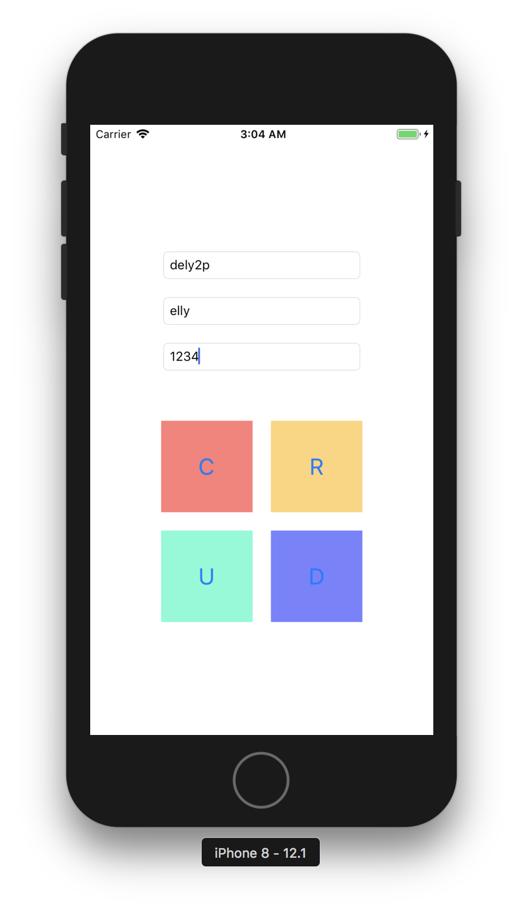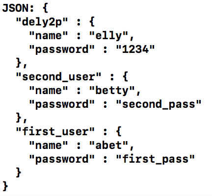

- U button & R button clicked

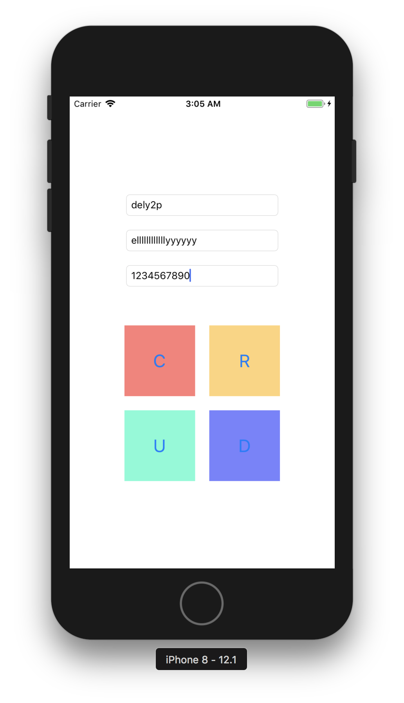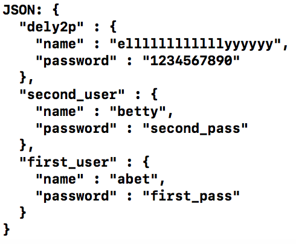

- D button & R button clicked

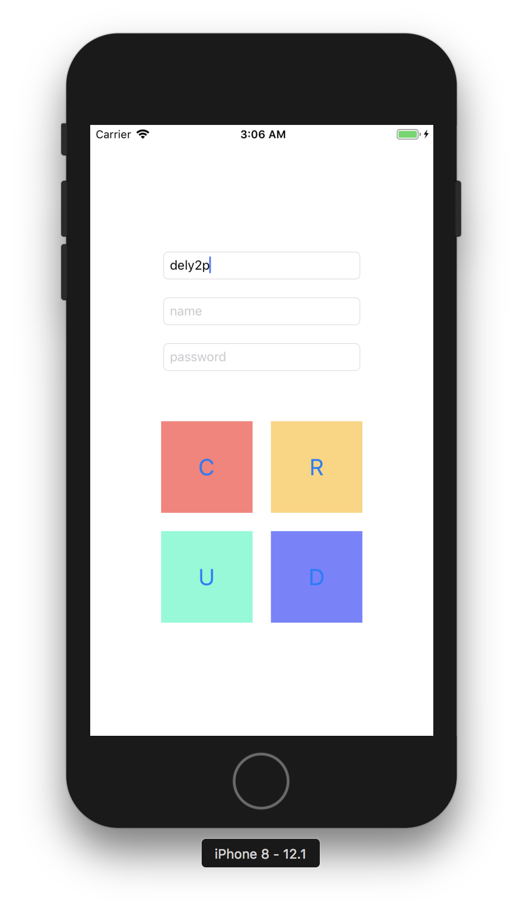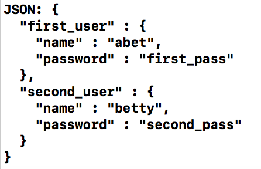

## step 2

> 서버 추가

- MagicSpells에서 사용 할 data(spell, effect, source)를 json형태로 만들어주는 서버 구현.
- 마법주문 list 출력, 마법주문 추가 기능 구현

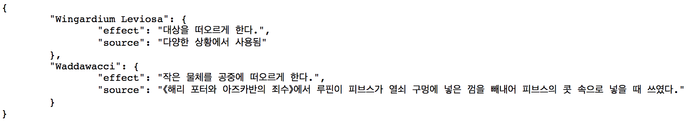

> 크롤링 기능 추가

- web에서 각 data(title, effect, source)를 크롤링하고, json 형태로 저장
- web에서 일정하지 않은 data 예외처리 구현
- 크롤링 사이트: https://ko.wikipedia.org/wiki/%ED%95%B4%EB%A6%AC_%ED%8F%AC%ED%84%B0%EC%9D%98_%EB%A7%88%EB%B2%95_%EB%AA%A9%EB%A1%9D

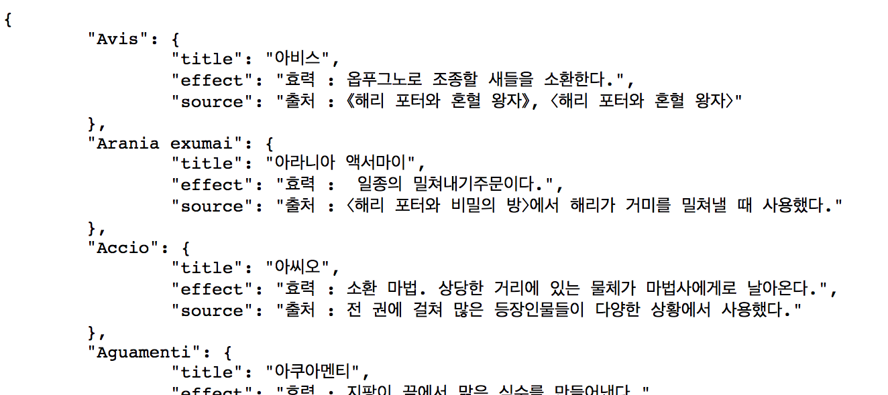

## step 3

> 서버 위치 이동(GCP)

- http://34.85.30.131:3000/list

> Realtime Search 기능 추가

- SearchBar 추가(programmatically)
	
	```swift
	self.definesPresentationContext = true
	self.navigationItem.titleView = searchController.searchBar
	searchController.hidesNavigationBarDuringPresentation = false
	```
	
	- 최상위 ViewController를 찾아서 그 view의 위에 SearchBar를 표시하기 위함
	- navigationBar titleView 부분에 SearchBar 추가
	- 검색 시 navigationBar를 사라지게 할지 설정
	
- UISearchResultsUpdating 프로토콜 updateSearchResults() 메소드 사용
- updateSearchResults() 메소드 안에서 사용자가 작성하는 검색어와 마법주문을 비교하여 같은 word로 시작하는 것을 테이블뷰에 출력하도록 구현

	```swift
	func updateSearchResults(for searchController: UISearchController) {
        if let searchText = searchController.searchBar.text {
            searchSpells = spells.filter({$0.prefix(searchText.count).uppercased() == searchText.uppercased()})
            print(searchSpells)
            searching = true
            self.magicSpellsTableView.reloadData()
        }
    }
	```

> sketch를 사용하여 free이미지 편집 및 추가

- Search Box 이미지 사용
	- https://www.sketchappsources.com/free-source/2-layout-ui-kit-template.html
	- 

> Tab Bar 추가

- Search(home), History, Favorite(my spells) 구성 예정

> 실행화면

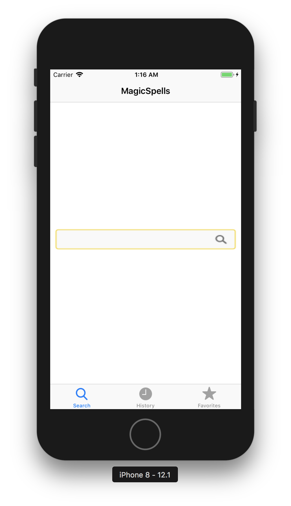 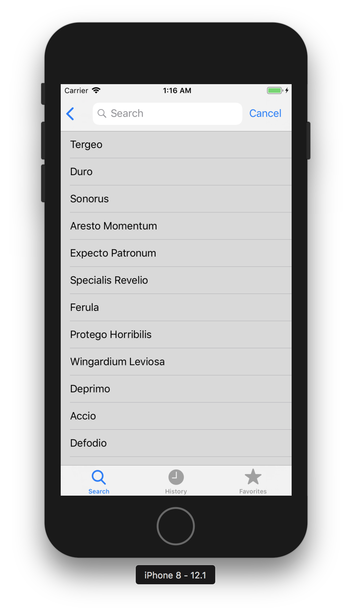
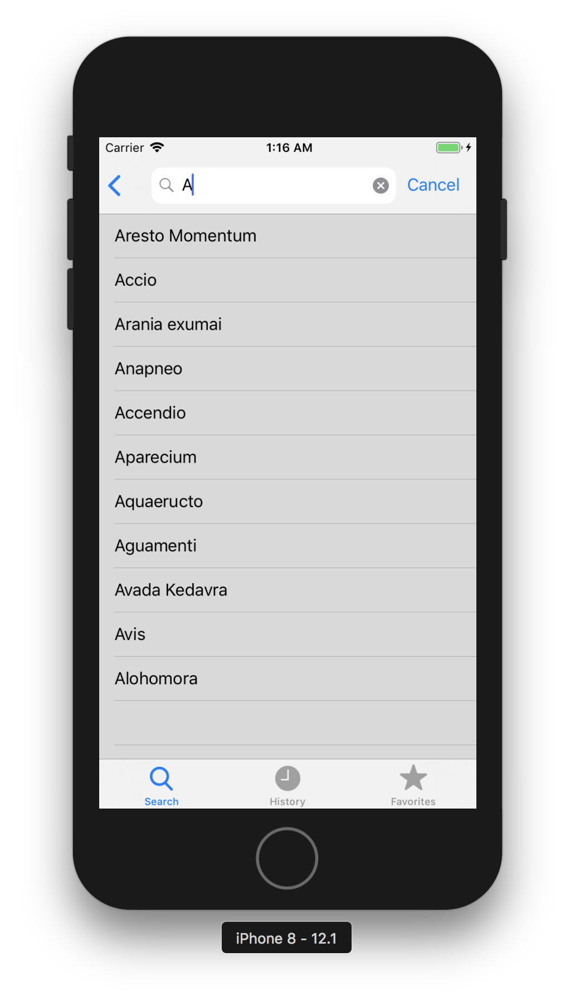 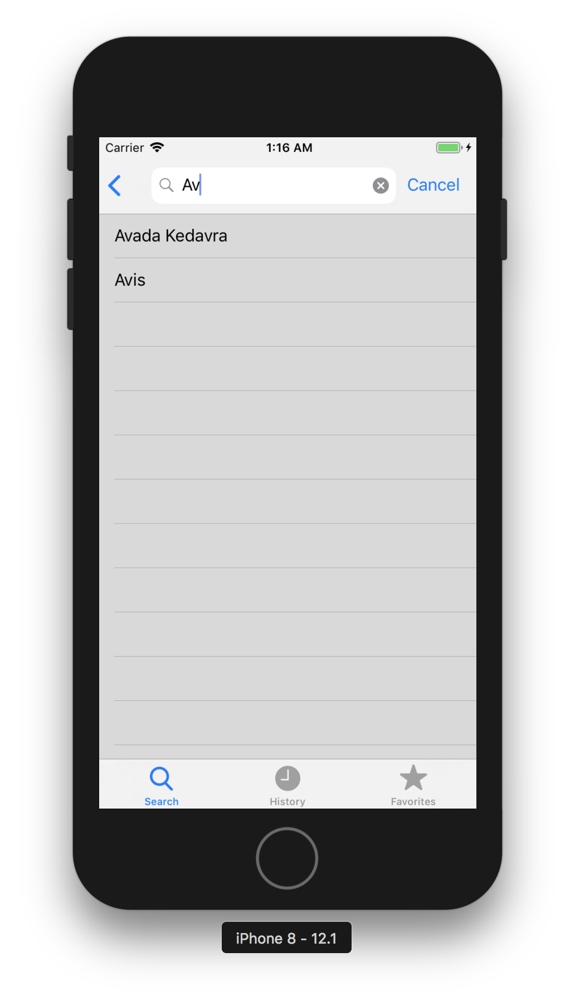

